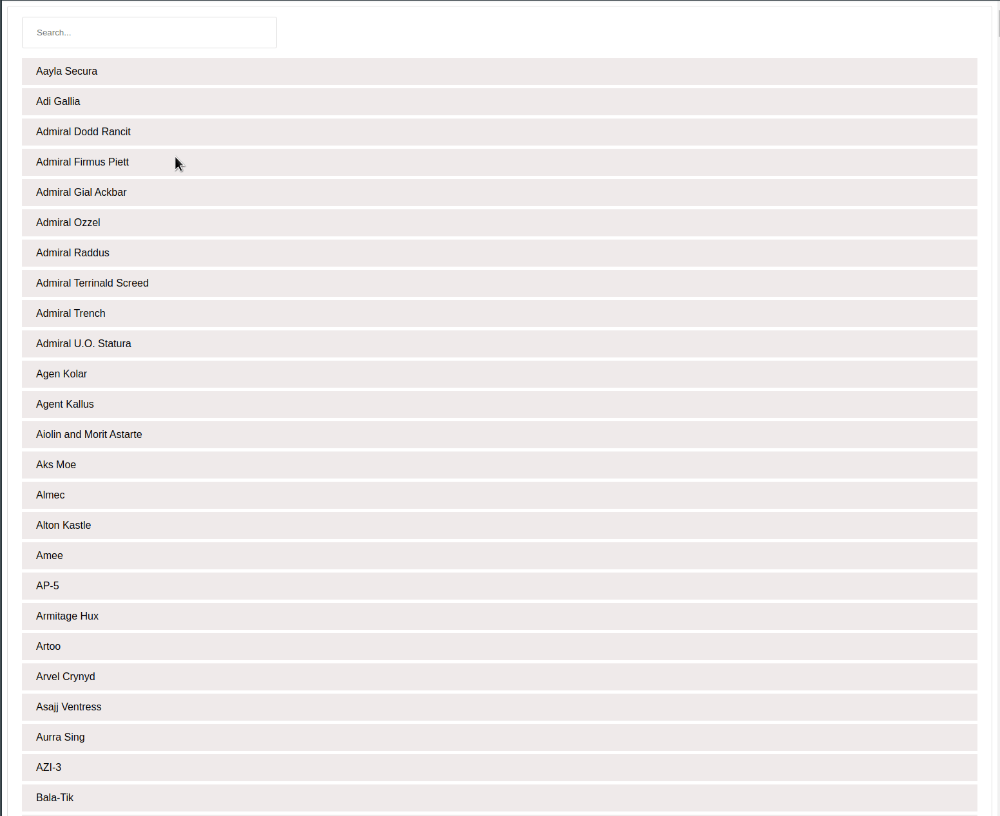

## Available Scripts

In the project directory, you can run:

### `npm start`

### `npm test`

### `npm run build`

## To do:

* check if filtered data is empty and is showed a empty block
* check if input is getting the default value from window location hash
* check if data is filtered after typing inside the input
